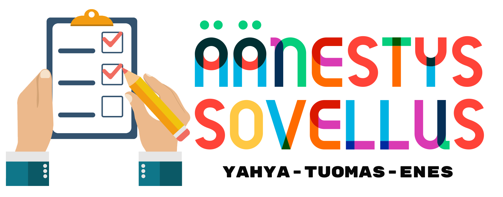

# Äänestys Sovellus - Tiimi projekti

Voit myös aktiivisesti käyttää sitä verkkosivuston https://aanestys.enes.fi kautta.

## Käyttöoikeudet
Sinulla on täysi oikeus käyttää tätä materiaalia omaan oppimiseesi. Lisäksi opettajat voivat saada pääsyn kaikkeen sisältöön ja käyttää sitä opiskelijoidensa kanssa. Kuitenkin kaikkien, jotka käyttävät tätä materiaalia - oli tarkoituksena mikä tahansa - tulee säilyttää alkuperäisen materiaalin viite, joka on luotu ja tarjottu Tuomas Lappalainen-Yahya Rouissi - Enes Koc toimesta. Tätä sisältöä ei saa missään tilanteessa käyttää kirjojen tai oppimateriaalien laatimiseen kokonaan tai osittain taloudellisen hyödyn saamiseksi kirjailijoiden, kustantajien tai oppilaitosten toimesta.
